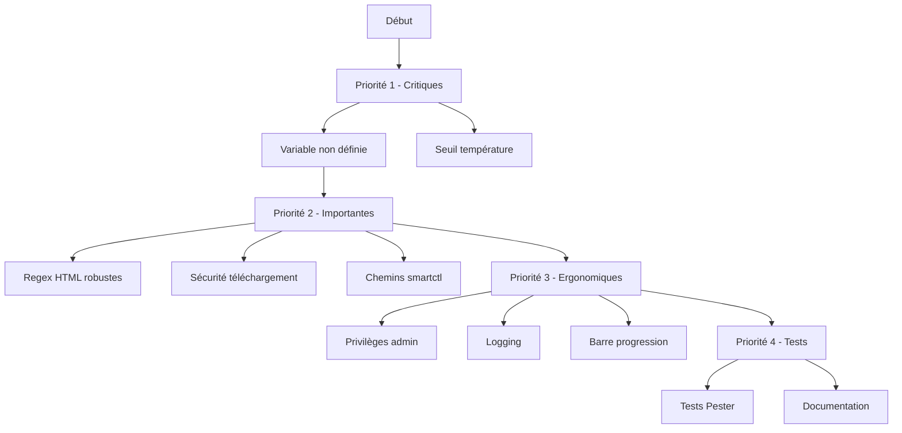

# Plan d'Amélioration - CompStats.ps1

## Vue d'Ensemble

Ce document définit le plan d'amélioration pour le script PowerShell CompStats.ps1. Les améliorations sont organisées par priorité et par catégorie.

---

## Structure du Projet

```
compstats4recycle/
├── CompStats.ps1           # Script principal à améliorer
├── test-script.ps1         # Tests existants
├── validation-syntax.ps1   # Validation syntaxique
├── /plans/                  # Répertoire des plans
│   └── PLAN_AMELIORATION.md # Ce fichier
└── README.md               # Documentation
```

---

## Priorité 1 : Corrections Critiques

### 1.1 Variable Non Définie

**Problème:** La variable `$occupiedSlots` est utilisée à la ligne 56 avant d'être définie (ligne 96).

**Localisation:** [`CompStats.ps1:56`](CompStats.ps1:56)

**Correction:**
```powershell
# AVANT (problématique)
if (-not $maxSlots -or $maxSlots -eq 0 -or $occupiedSlots -eq 0) {

# APRÈS (corrigé)
if (-not $maxSlots -or $maxSlots -eq 0) {
```

**Impact:** Élevé - Peut causer des erreurs inattendues

---

### 1.2 Incohérence Seuil de Température

**Problème:** Le code utilise 60°C mais le README indique 50°C comme seuil d'avertissement.

**Localisation:** [`CompStats.ps1:374`](CompStats.ps1:374)

**Correction:**
```powershell
# AVANT
if ($smart.Temp -and $smart.Temp -ne "Non détecté" -and ($smart.Temp -as [int]) -gt 60) { $warnings++ }

# APRÈS - aligné avec README
if ($smart.Temp -and $smart.Temp -ne "Non détecté" -and ($smart.Temp -as [int]) -gt 50) { $warnings++ }
```

**Impact:** Moyen - Incohérence documentation/code

---

## Priorité 2 : Améliorations Importantes

### 2.1 Regex de Parsing HTML Résistantes

**Objectif:** Rendre le parsing du battery report HTML plus robuste.

**Améliorations:**
- Utiliser le mode single-line (`(?s)`) pour les regex
- Ajouter des fallbacks pour chaque extraction
- Implémenter une fonction utilitaire de parsing

**Fonction propuesta:**
```powershell
function Extract-BatteryValue {
    param($content, $pattern, $default = "Non détecté")
    if ($content -match "(?s)$pattern") {
        return $matches[1].Trim()
    }
    return $default
}
```

---

### 2.2 Sécurité du Téléchargement

**Objectif:** Sécuriser le téléchargement automatique de smartctl.

**Améliorations:**
- Activer TLS 1.2 minimum
- Ajouter une vérification de certificat
- Valider le fichier téléchargé (taille, hash)

**Implementation proposée:**
```powershell
# Configuration sécurité
[Net.ServicePointManager]::SecurityProtocol = [Net.SecurityProtocolType]::Tls12

# Téléchargement avec validation
try {
    $webClient = New-Object System.Net.WebClient
    $webClient.DownloadFile($zipUrl, $zipPath)
    
    # Vérifier taille minimale (smartmontools ~5MB)
    if ((Get-Item $zipPath).Length -lt 1000000) {
        throw "Fichier téléchargé trop petit"
    }
} catch {
    Write-Warning "Échec téléchargement: $($_.Exception.Message)"
}
```

---

### 2.3 Chemins smartctl Multi-Plateforme

**Objectif:** Supporter les installations 32-bit et 64-bit de smartmontools.

**Correction proposée:**
```powershell
$smartctlPaths = @(
    "C:\Program Files\smartmontools\bin\smartctl.exe",
    "C:\Program Files (x86)\smartmontools\bin\smartctl.exe",
    "$env:LOCALAPPDATA\smartmontools\bin\smartctl.exe"
)

foreach ($path in $smartctlPaths) {
    if (Test-Path $path) {
        $smartctlPath = $path
        break
    }
}
```

---

## Priorité 3 : Améliorations Ergonomiques

### 3.1 Vérification Privilèges Administrateur

**Objectif:** Informer l'utilisateur si certains informations nécessitent admin.

**Ajout proposé en début de script:**
```powershell
function Test-IsAdmin {
    $currentUser = [Security.Principal.WindowsIdentity]::GetCurrent()
    $principal = New-Object Security.Principal.WindowsPrincipal($currentUser)
    return $principal.IsInRole([Security.Principal.WindowsBuiltInRole]::Administrator)
}

$isAdmin = Test-IsAdmin
if (-not $isAdmin) {
    Write-Warning "Certains informations nécessitent des privilèges administrateur"
}
```

---

### 3.2 Système de Logging

**Objectif:** Remplacer Write-Host par un système de logging structuré.

**Fonctions à ajouter:**
```powershell
$script:LogFile = Join-Path $PSScriptRoot "compstats.log"

function Write-Log {
    param(
        [Parameter(Mandatory)]
        [string]$Message,
        
        [ValidateSet("INFO", "WARNING", "ERROR", "DEBUG")]
        [string]$Level = "INFO"
    )
    
    $timestamp = Get-Date -Format "yyyy-MM-dd HH:mm:ss"
    $logEntry = "[$timestamp] [$Level] $Message"
    
    # Sortie console avec couleur
    switch ($Level) {
        "ERROR"   { Write-Host $logEntry -ForegroundColor Red }
        "WARNING" { Write-Host $logEntry -ForegroundColor Yellow }
        "DEBUG"   { Write-Host $logEntry -ForegroundColor Gray }
        default   { Write-Host $logEntry }
    }
    
    # Écriture fichier
    Add-Content -Path $script:LogFile -Value $logEntry
}
```

---

### 3.3 Barre de Progression

**Objectif:** Améliorer l'expérience utilisateur avec une barre de progression.

```powershell
$steps = @(
    "Collecte informations système",
    "Collecte informations CPU",
    "Collecte informations RAM",
    "Collecte informations disques",
    "Collecte données SMART",
    "Collecte informations batterie",
    "Génération rapport HTML"
)

$totalSteps = $steps.Count
$currentStep = 0

foreach ($step in $steps) {
    $currentStep++
    Write-Progress -Activity "CompStats" -Status $step -PercentComplete (($currentStep / $totalSteps) * 100)
    # ... exécution de la tâche ...
}

Write-Progress -Activity "CompStats" -Completed
```

---

## Priorité 4 : Tests et Documentation

### 4.1 Tests Unitaires Améliorés

**Fichiers à créer/modifier:**
- `tests/unit/Get-SystemInfo.tests.ps1`
- `tests/unit/Get-CPUInfo.tests.ps1`
- `tests/unit/Get-RAMInfo.tests.ps1`
- `tests/integration/FullReport.tests.ps1`

**Framework recommandé:** Pester

```powershell
# Exemple test unitaire
Describe "Get-RAMInfo" {
    It "Returns a hashtable with Total, MaxSlots, Modules, IsIntegrated" {
        $result = Get-RAMInfo
        $result | Should -Not -BeNullOrEmpty
        $result.Total | Should -Match "\d+(\.\d+)?\s*GB"
        $result.IsIntegrated | Should -BeOfType [bool]
    }
}
```

---

### 4.2 Documentation Technique

**Fichiers à créer:**
- `/docs/ARCHITECTURE.md` - Architecture technique
- `/docs/CONTRIBUTING.md` - Guide de contribution
- `/docs/API.md` - Documentation des fonctions

---

## Récapitulatif des Tâches

| # | Tâche | Priorité | Difficulté |
|---|-------|----------|------------|
| 1 | Corriger variable $occupiedSlots | 🔴 Critique | Facile |
| 2 | Aligner seuil température (50°C) | 🔴 Critique | Facile |
| 3 | Améliorer regex parsing HTML | 🟡 Important | Moyen |
| 4 | Sécuriser téléchargement smartctl | 🟡 Important | Moyen |
| 5 | Chemins smartctl multi-plateforme | 🟡 Important | Facile |
| 6 | Vérification privileges admin | 🟢 Amélioration | Facile |
| 7 | Système de logging | 🟢 Amélioration | Moyen |
| 8 | Barre de progression | 🟢 Amélioration | Facile |
| 9 | Tests unitaires (Pester) | 🟢 Amélioration | Moyen |
| 10 | Documentation technique | 🟢 Amélioration | Facile |

---

## Diagramme de Dépendance



---

## Conclusion

Ce plan d'amélioration est structuré par ordre de priorité:
1. **Corrections critiques** - À faire en priorité absolue
2. **Améliorations importantes** - À implémenter dans une v2
3. **Améliorations ergonomiques** - Qualité de vie
4. **Tests et documentation** - Pour la maintenabilité

Le projet CompStats.ps1 est déjà fonctionnel et bien structuré. Ces améliorations le rendront plus robuste, sécurisé et maintenable.